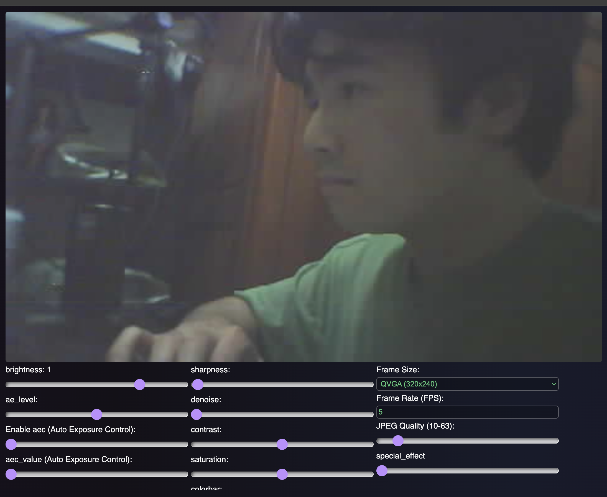

Espressif is <u>C-Based</u>, so using `main.c` is more straight forward and comform to the default way. In this project, I use command line and VSCode to build the project. (Also don't need the ESP-IDF extension. It is optional.)

You can also use Arduino IDE, or VSCode's extension to build staff with ESP32.



> <h2 id='toc0'>Table of Content</h2>

1. <a href='#requirements'>requirements</a>
2. <a href='#build'>build</a>
3. <a href='#menuconfig'>menuconfig</a>
4. Additional Information
   1. <a href='#webserver'>webserver</a>
   2. <a href='#kconfig.projectbuild'>kconfig.projectbuild</a>

<h1 id="requirements" style="font-weight: 700; text-transform: capitalize; font-family: 'Segoe UI', Tahoma, Geneva, Verdana, sans-serif; color: #EA638C;">&#9698; requirements</h1>
<a href='#toc0' style='background: #000; margin:0 auto; padding: 5px; border-radius: 5px;'>Back to ToC</a><br><br>

### **Official Install Guide**

[Link](https://docs.espressif.com/projects/esp-idf/en/stable/esp32/get-started/index.html)

### **My Install Guide**

Follow the steps one at a time.

1. Install `esp-idf` and `.espressif` folder on your computer.
   1. `cd ${UserFolder}` (where you want to store most of the dependencies & components' headers)
   2. `mkdir esp` (Optional) make a custom folder
   3. `git clone -b v5.2.3 --recursive https://github.com/espressif/esp-idf.git` (This will take a while. Quite a lot of things to download.)
   4. `cd ~/esp/esp-idf` (This is where you git clone the above dependencies)
   5. `./install.sh esp32` or `./install.ps1 esp32` (Now, install the required tools depending on the OS or shell you are using. This only install tools for esp32. If you need more chips' libraries, run something like this `./install.sh esp32,esp32s2` or `./install.sh all`)
   6. After the previous step, in your ${UserFolder}, you should be able to find `.espressif/` directory which contains more tools (like compilers) for development.
2. Export the paths or set the paths as environmental variables.
   - For Mac, `. ~/esp/esp-idf/export.sh`
   - For Windows, open start and set the paths in environmental variables.

<h1 id="build" style="font-weight: 700; text-transform: capitalize; font-family: 'Segoe UI', Tahoma, Geneva, Verdana, sans-serif; color: #EA638C;">&#9698; build</h1>
<a href='#toc0' style='background: #000; margin:0 auto; padding: 5px; border-radius: 5px;'>Back to ToC</a><br><br>

To build the project, if somehow you didn't set the environmental variables (or on Unix-like OS, you didn't export the $PATH), you just need to locate `idf.py` which will be at the ${UserFolder} or wherever you installed the previous steps.

Now, once you finish the project. Run following:

1. `idf.py menuconfig` (Use the [menuconfig](#menuconfig) to configure the build settings etc.) 
2. `idf.py build` (To build the project.)
3. Connect your ESP hardware to your computer. 
4. `idf.py flash` (This will auto detect a port if `-p` is not provided.) 
5. After flashing to your hardware, you need to press the <span style='color: #FF595E;'>**RST**</span> button on your hardware, it should have a label next to it. 
6. `idf.py -p $MY_PORT monitor` (Now you can run your hardware. Replace the port shown in <u>the flashing step</u>.)
   - Use CTRL + ']' to quit the monitor mode.


set PSRAM, partitions, QIO, 80MB blah blah

partitions.csv needed

<h1 id="menuconfig" style="font-weight: 700; text-transform: capitalize; font-family: 'Segoe UI', Tahoma, Geneva, Verdana, sans-serif; color: #EA638C;">&#9698; menuconfig</h1>
<a href='#toc0' style='background: #000; margin:0 auto; padding: 5px; border-radius: 5px;'>Back to ToC</a><br><br>

# **SPI mode**

| **Mode** | **Data Lines** | **Maximum SPI Speed** | **Typical Throughput**      | **Use Case**                                |
|----------|----------------|-----------------------|------------------------------|---------------------------------------------|
| **QIO**  | 4              | Up to 80 MHz          | ~320 Mbps                    | High-speed read/write operations requiring maximum throughput. |
| **QOUT** | 4              | Up to 80 MHz          | ~320 Mbps (read), Enhanced write speeds | Read operations at high speed with optimized write performance. |
| **DIO**  | 2              | Up to 40 MHz          | ~80 Mbps                     | Balanced speed and pin usage for general-purpose applications. |
| **DOUT** | 2              | Up to 40 MHz          | ~80 Mbps (read), Improved write performance | Read operations with optimized write speed using fewer pins. |


# **SPI Speed**

SPI (Serial Peripheral Interface) speed refers to the data transfer rate in a communication protocol commonly used in electronics and embedded systems. 

- SPI is a synchronous serial communication interface used for short-distance communication between electronic devices.
- Speed is measured in MHz (megahertz), indicating how many million data bits can be transferred per second.
- Generally, higher SPI speeds are better because they allow faster data transmission between devices.

# **Flash Size**

Flash size refers to the amount of <span style='color: #FF595E;'>**non-volatile memory available for storing firmware (the program code)**</span> on a microcontroller or an external flash memory chip. 

<span style='color: #FF595E;'>**This memory retains data even when the power is turned off**</span>, making it essential for storing the code that runs your microcontrollers.

# **PSRAM**

Inside <u>Component config tab</u>.

PSRAM (Pseudo-Static Random Access Memory) is a type of external RAM that combines the simplicity of SRAM with the density of DRAM. 

In the context of ESP32 microcontrollers, PSRAM serves as an additional memory resource to enhance the device's capabilities.

# **partitions.csv**

The provided `partitions.csv` file defines the partition layout for an ESP32 microcontroller. Partition tables are crucial in embedded systems like the ESP32 because they allocate specific regions of the flash memory for different purposes, ensuring organized storage and efficient management of firmware, data, and other essential components.

- **Name:** A human-readable identifier for the partition.
- **Type:** The general category of the partition (e.g., `app`, `data`).
- **SubType:** A more specific classification within the main type (e.g., `nvs`, `ota`, `coredump`).
- **Offset:** The starting address of the partition in flash memory (in hexadecimal).
- **Size:** The size allocated to the partition (in hexadecimal).
- **Flags:** Additional attributes or markers for the partition (often left blank).


# **sdkconfig**

Configure you wifi username and password with the following var names:

```shell
CONFIG_WIFI_SSID="xxxxx_wifi"
CONFIG_WIFI_PASSWORD="xxxxxxx"
```


<h1 id="webserver" style="font-weight: 700; text-transform: capitalize; font-family: 'Segoe UI', Tahoma, Geneva, Verdana, sans-serif; color: #F4B400;">&#9698; webserver</h1>
<a href='#toc0' style='background: #000; margin:0 auto; padding: 5px; border-radius: 5px;'>Back to ToC</a><br><br>

Building a webserver with the `esp_http_server.h`, sometimes it may be unreachable for Chrome, but the server works on Safari, FireFox, and potentially other browsers.

<h1 id="kconfig.projectbuild" style="font-weight: 700; font-family: 'Segoe UI', Tahoma, Geneva, Verdana, sans-serif; color: #F4B400;">&#9698; kconfig.projectbuild</h1>
<a href='#toc0' style='background: #000; margin:0 auto; padding: 5px; border-radius: 5px;'>Back to ToC</a><br><br>

This file (`kconfig.projectbuild`) will add a new menu to `idf.py menuconfig`, where you can set environmental variables. To get the values, `#include "sdkconfig.h"`, and then use something like this `CONFIG_WIFI_SSID`.